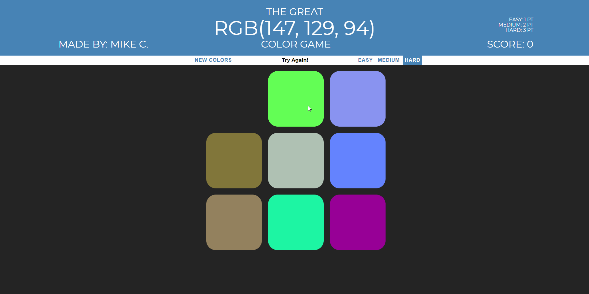

# Color-Game
This is a color guessing game where the user must choose the correct color box based on the given RGB code.

### Game Modes
<ul>
  <li>Easy: three color squares
    <ul>
      <li>1 point gained if won</li>
    </ul>
  </li>
  <li>Medium: six color squares
    <ul>
      <li>2 points gained if won</li>
    </ul>
  </li>
  <li>Hard: nine color squares
    <ul>
      <li>3 points gained if won</li>
    </ul>
  </li>
</ul>

  
<strong>Clicking any of the game modes or the reset button will reset the game board.</strong>

### How to Win
Click the squares to match the RGB code shown at the top of the page. If correctly selected, all of the squares will appear and change into the winning color.

